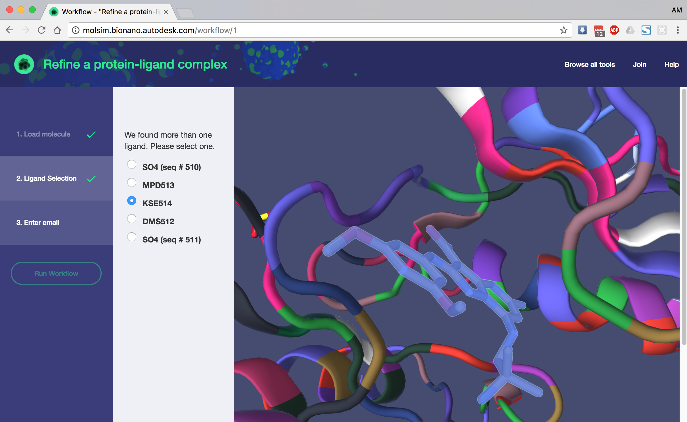

# Molecular Workflow Repository

- [Contents](#molecular-workflow-repository)
  * [Install](#install-cli-tool)
  * [Run it](#running-from-the-command-line)
  * [Creating your first app](#creating-your-first-app)
  * [Publishing your workflows](#publishing-your-workflows)
  * [Publishing your own apps](#publishing-your-own-apps)
  * [Workflow Advisory Board](#workflow-advisory-board)

This repository is an open, growing collection of easy-to-run molecular modeling workflows. These can be thought of as "runnable methods sections" - modular computational workflows that let scientists easily:
 1. use published methods,
 2. publish their own methods, and
 3. iterate and build on other's work.
 
It's also easy to turn one more workflows into "apps" - easy-to-use, web-based user interfaces that give a huge audience access to the power of computational chemistry. Anyone can run a the published apps, right now, from the [Molecular Simulation Tools website](https://molsim.bionano.autodesk.com).



[Click here to get started with the official workflow apps](https://molsim.bionano.autodesk.com), or for more information, check out the [documentation](docs/index.md).


## Install CLI Tool

You can run the official workflows apps right from your browser with the [MST web application](https://molsim.bionano.autodesk.com).

If you'd like to run them from the command line, or start working on your own, you'll need to install:
 
 - [Docker](https://docs.docker.com/engine/installation/)
 - [git](https://git-scm.com/book/en/v2/Getting-Started-Installing-Git)
 - [Python 2.7 or 3.5+](https://www.python.org/downloads/)

After that, you can install everything else you need by running:

```bash
git clone https://git.autodesk.com/virshua/molecular-workflow-repository.git
pip install -e molecular-workflow-repository
```

to install the workflows locally.

#### In a docker container
To build a ready-to-go docker container, run:

```bash
git clone https://git.autodesk.com/virshua/molecular-workflow-repository.git
cd molecular-workflow-repository
docker-compose run molflow_env 
```


## Running from the command line

Installing this package will put the `molflow` executable in your path.

 - To get a list of available workflows, run `molflow --list`:
```yaml
$ molflow list
mm_minimize: "MM Minimization with automatically parameterized non-standard residues"
equilibrate: "Equilibrate a system at a given temperature"
photoexcitation: "Calculate the excitation energy of a given conformer"
[...]
```
 - To get more information about a workflow, run `molflow --help [workflow name]`:
```yaml
$ molflow info add_two_to_it
Name: add_two_to_it
Version: unversioned
Inputs:
- number: (number) Number to add two to
Outputs:
- result: (number) Original number plus two
Description: Add 2 to integer, float, or complex number.
[...]
```

[This page](docs/workflows/metadata.md) contains a more complete description of the metadata included with each workflow.

 - To run a workflow, run `molflow [workflow name] --[input name] [input file]`, e.g.:
```yaml
$ molflow molflow run add_two_to_it 4.0
Output directory: ~/add_two_to_it.run

Starting workflow 'add_two_to_it'
add_one.1:
  job_id: e94dfa025d722c5d0dc668ef552b5c312bc0e83a8c3da43aa2a9cefd87df7063
[...]
Finished workflow 'add_two_to_it'.

Output locations:
  result:
  - add_two_to_it.run/result.pkl
  - add_two_to_it.run/result.txt
```
NOTE: This requires that docker is running locally on your machine.


## Creating your first app

WIP

## Publishing your workflows

WIP

 
## Publishing your own apps

WIP
 

## Workflow Advisory Board
WIP


